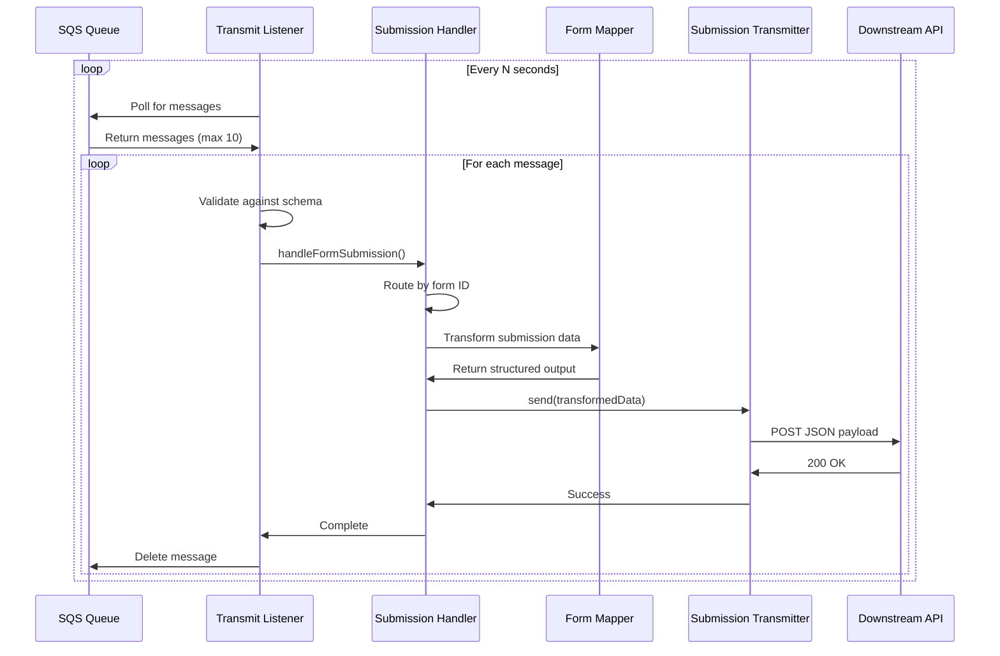
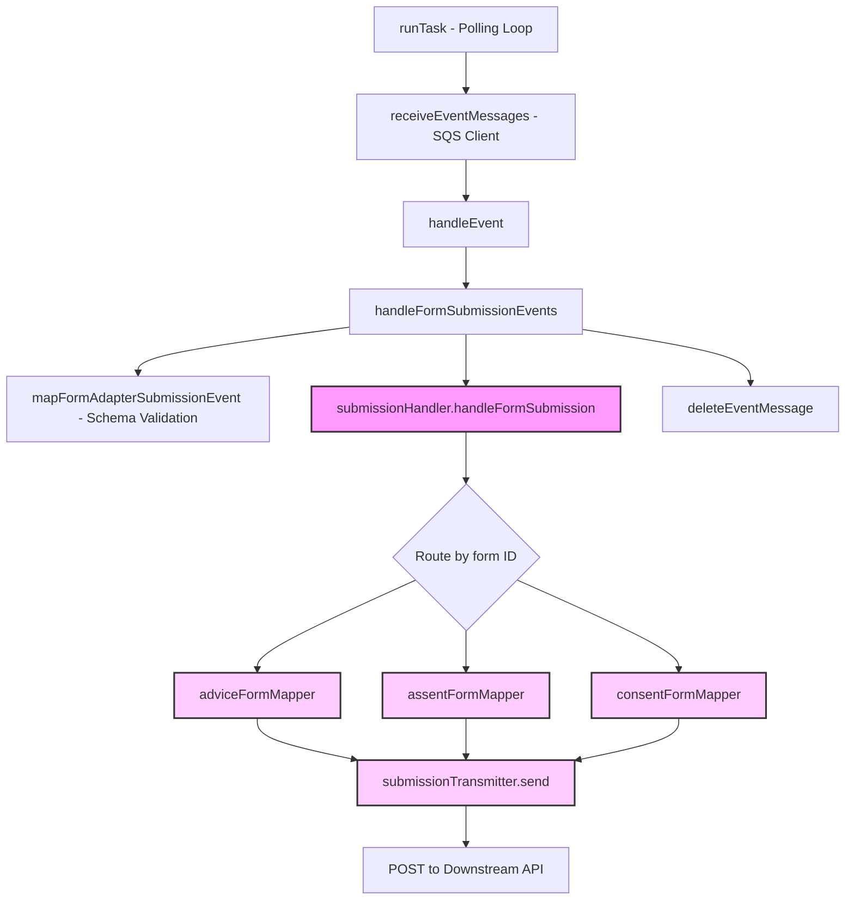
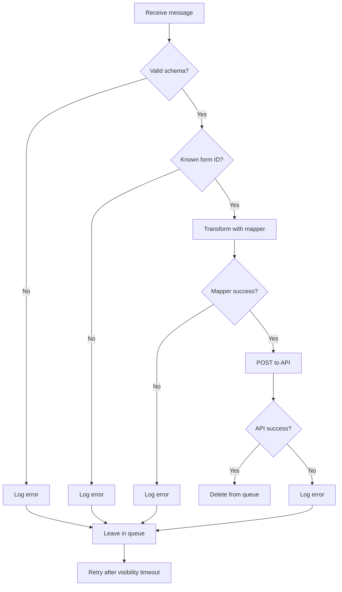

# Architecture

## System overview

```mermaid
graph LR
    A[User submits form] --> B[Forms Platform]
    B --> C[SNS Topic]
    C --> D[SQS Queue]
    D --> E[Transmit Listener]
    E --> F[Form Mapper]
    F --> G[Submission Transmitter]
    G --> H[Downstream API]
    E --> D

    style E fill:#f9f,stroke:#333,stroke-width:4px
    style F fill:#fcf,stroke:#333,stroke-width:2px
    style G fill:#fcf,stroke:#333,stroke-width:2px
```

The transmit listener sits between the SQS queue and the downstream API. It transforms raw form submissions into a structured format before transmission.

## Message flow

## Component architecture

The submission handler routes each submission to the appropriate form mapper based on the form ID in the message metadata. Each mapper transforms the raw submission data into a structured output format, which is then sent to the downstream API by the submission transmitter.

## Processing guarantees

### At-least-once delivery

Messages may be processed more than once if:

- The handler takes longer than the visibility timeout
- The service crashes after processing but before deletion
- AWS SQS delivers duplicates (rare)

### Ordering

Messages are processed in **approximate** FIFO order but this is not guaranteed.

### Retry behaviour

Failed messages automatically retry based on the SQS queue configuration:

- **Visibility timeout** - Messages become available again after the timeout period
- **Max receives** - After N failed attempts, messages move to a dead letter queue
- **Redrive policy** - Configure your dead letter queue settings

## Visibility timeout

When a message is received, it becomes invisible to other consumers for the visibility timeout period. This prevents duplicate processing while the handler runs.

Set this to **longer than the expected execution time** of the mapper and API call combined, with buffer.

## Scaling

### Single instance

- Processes messages sequentially
- Simple and predictable
- Lower throughput

### Multiple coroutines

- Configure `CONCURRENT_COROUTINES` to run multiple polling loops in parallel
- Each coroutine polls independently
- Higher throughput within a single instance

### Multiple instances

- Each instance polls independently
- Messages distributed across instances
- Highest throughput
- Still at-least-once delivery

## Health checks

The service exposes a `GET /health` endpoint:

- Returns `200 OK` with `{ message: 'success' }` when healthy
- Use for Kubernetes liveness/readiness probes
- Use for load balancer health checks

## Error handling

Failed messages remain in the queue and retry automatically. Configure a dead letter queue to capture messages that fail repeatedly.
