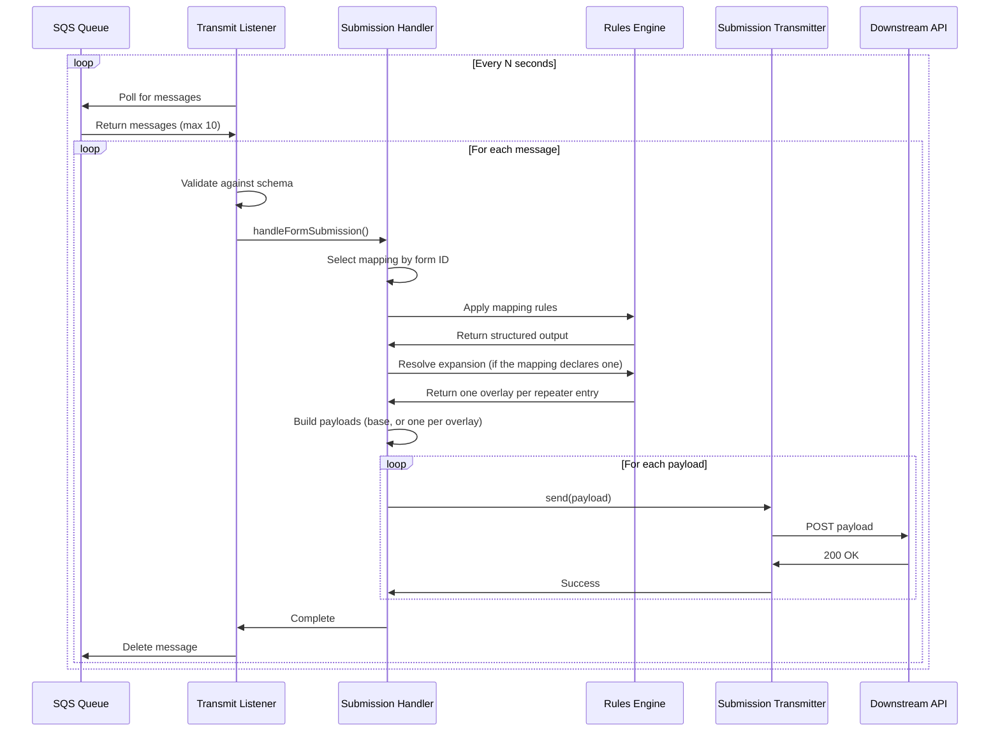
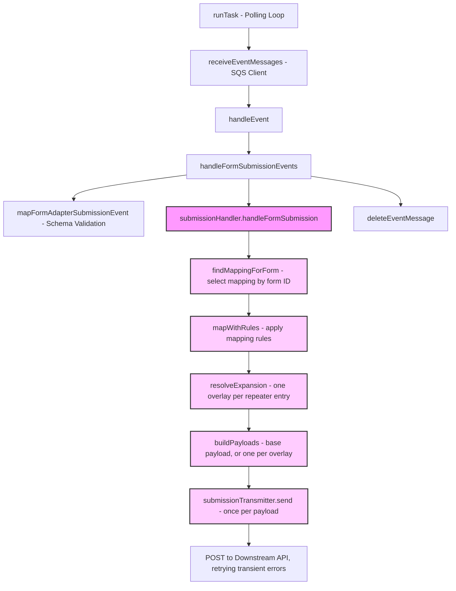
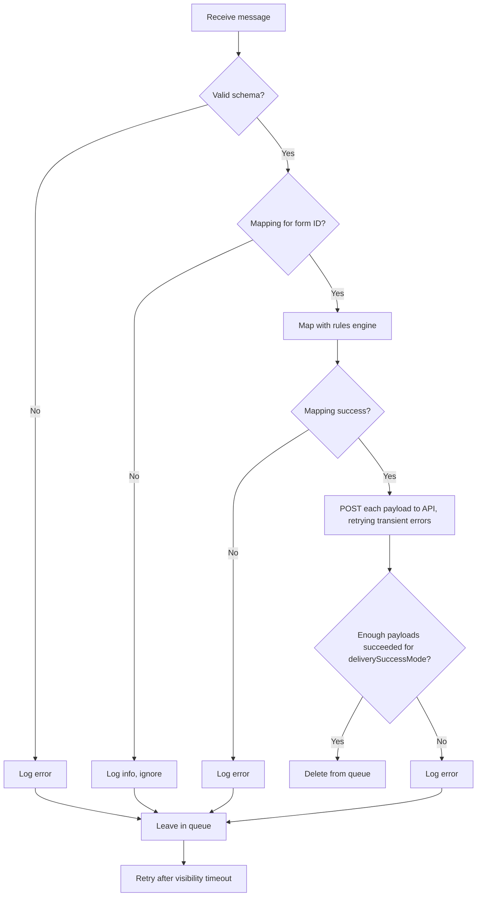

# Architecture

## System overview

```mermaid
graph LR
    A[User submits form] --> B[Forms Platform]
    B --> C[SNS Topic]
    C --> D[SQS Queue]
    D --> E[Transmit Listener]
    E --> F[Rules Engine]
    F --> G[Submission Transmitter]
    G --> H[Downstream API]
    E --> D

    style E fill:#f9f,stroke:#333,stroke-width:4px
    style F fill:#fcf,stroke:#333,stroke-width:2px
    style G fill:#fcf,stroke:#333,stroke-width:2px
```

The transmit listener sits between the SQS queue and the downstream API. It transforms raw form submissions into a structured format before transmission.

## Message flow

```mermaid
sequenceDiagram
    participant Queue as SQS Queue
    participant Listener as Transmit Listener
    participant Handler as Submission Handler
    participant Engine as Rules Engine
    participant Transmitter as Submission Transmitter
    participant API as Downstream API

    loop Every N seconds
        Listener->>Queue: Poll for messages
        Queue->>Listener: Return messages (max 10)

        loop For each message
            Listener->>Listener: Validate against schema
            Listener->>Handler: handleFormSubmission()
            Handler->>Handler: Select mapping by form ID
            Handler->>Engine: Apply mapping rules
            Engine->>Handler: Return structured output
            Handler->>Engine: Resolve expansion (if the mapping declares one)
            Engine->>Handler: Return one overlay per repeater entry
            Handler->>Handler: Build payloads (base, or one per overlay)

            loop For each payload
                Handler->>Transmitter: send(payload)
                Transmitter->>API: POST payload
                API->>Transmitter: 200 OK
                Transmitter->>Handler: Success
            end

            Handler->>Listener: Complete
            Listener->>Queue: Delete message
        end
    end
```

## Component architecture

```mermaid
graph TD
    A[runTask - Polling Loop] --> B[receiveEventMessages - SQS Client]
    B --> C[handleEvent]
    C --> D[handleFormSubmissionEvents]
    D --> E[mapFormAdapterSubmissionEvent - Schema Validation]
    D --> F[submissionHandler.handleFormSubmission]
    F --> G[findMappingForForm - select mapping by form ID]
    G --> H[mapWithRules - apply mapping rules]
    H --> I[resolveExpansion - one overlay per repeater entry]
    I --> J[buildPayloads - base payload, or one per overlay]
    J --> K[submissionTransmitter.send - once per payload]
    K --> L[POST to Downstream API, retrying transient errors]
    D --> M[deleteEventMessage]

    style F fill:#f9f,stroke:#333,stroke-width:2px
    style G fill:#fcf,stroke:#333,stroke-width:2px
    style H fill:#fcf,stroke:#333,stroke-width:2px
    style I fill:#fcf,stroke:#333,stroke-width:2px
    style J fill:#fcf,stroke:#333,stroke-width:2px
    style K fill:#fcf,stroke:#333,stroke-width:2px
```

The submission handler selects the mapping file whose `formIds` contains the form ID in the message metadata, then the rule-based engine applies that mapping's rules to transform the raw submission data into a structured output format, which is sent to the downstream API by the submission transmitter.

## One message, one or more payloads

A submission usually produces exactly one payload. A mapping file may declare an `expand` block, which fans the submission out into one payload per entry of a named repeater — the NEWLS Consent form uses this to send CWT one submission per land owner or occupier named on a notice. See [payload expansion](mapping-system/02-mapping-file-format.md#payload-expansion) for the format.

Bcause a message is only deleted from the queue once **the handler** resolves, a partial failure has no per-payload checkpoint to resume from: redelivering re-sends the payloads that already succeeded. Each mapping picks its success mode with `deliverySuccessMode` — `all` (default) fails the message if any of the multiple payloads failed to be received, accepting duplicates on redelivery (due to reprocessing of the queue); `any` succeeds if at least one payload lands, accepting that the rest are lost and logged as errors. If every payload fails, both modes fail the message.

## Processing guarantees

### At-least-once delivery

Messages may be processed more than once if:

- The handler takes longer than the visibility timeout
- The service crashes after processing but before deletion
- AWS SQS delivers duplicates (rare)

### Ordering

Messages are processed in **approximate** FIFO order but this is not guaranteed.

### Retry behaviour

There are two layers of retry: a fine-grained one around each API call, and the queue's own redelivery.

#### Send retries (per payload)

Each POST to the downstream API is retried with exponential back-off and jitter before the send is considered failed, so a transient blip never costs a whole message. Only errors that could plausibly succeed on a retry are retried:

| Outcome                       | Retried? | Why                                                                    |
| ----------------------------- | -------- | ---------------------------------------------------------------------- |
| Network error (DNS, reset, …) | Yes      | Nothing reached the API                                                |
| `5xx`                         | Yes      | The API failed, not the payload                                        |
| `429`                         | Yes      | Rate limited — back-off is exactly the right response                  |
| `4xx` (400, 401, …)           | No       | The payload or credentials are wrong; it fails the same way every time |

Configured with:

| Variable                                | Default | Meaning                             |
| --------------------------------------- | ------- | ----------------------------------- |
| `UNIVERSITY_API_RETRY_MAX_ATTEMPTS`     | `3`     | Total attempts, including the first |
| `UNIVERSITY_API_RETRY_INITIAL_DELAY_MS` | `500`   | Delay before the second attempt     |
| `UNIVERSITY_API_RETRY_MAX_DELAY_MS`     | `10000` | Ceiling on the back-off             |

Each delay doubles up to the ceiling, then has jitter applied (a random 50–100% of the computed delay) so that concurrent payloads and instances do not retry in lockstep. Keep the queue visibility timeout comfortably above the worst-case total: attempts × payloads × delays.

The retry helper is `src/lib/retry.js`; the transmitter classifies which errors are transient.

#### Message redelivery (per message)

Once the retries are exhausted, the failure surfaces to the handler and the message is left in the queue:

- **Visibility timeout** - Messages become available again after the timeout period
- **Max receives** - After N failed attempts, messages move to a dead letter queue
- **Redrive policy** - Configure your dead letter queue settings

For an expanded submission, redelivery re-sends every payload — see the `deliverySuccessMode` note above.

## Visibility timeout

When a message is received, it becomes invisible to other consumers for the visibility timeout period. This prevents duplicate processing while the handler runs.

Set this to **longer than the expected execution time** of the mapping and API call combined, with buffer.

## Scaling

### Single instance

- Processes messages sequentially
- Simple and predictable
- Lower throughput

### Multiple coroutines

- Configure `CONCURRENT_COROUTINES` to run multiple polling loops in parallel
- Each coroutine polls independently
- Higher throughput within a single instance

### Multiple instances

- Each instance polls independently
- Messages distributed across instances
- Highest throughput
- Still at-least-once delivery

## Health checks

The service exposes a `GET /health` endpoint:

- Returns `200 OK` with `{ message: 'success' }` when healthy
- Use for Kubernetes liveness/readiness probes
- Use for load balancer health checks

## Error handling

```mermaid
graph TD
    A[Receive message] --> B{Valid schema?}
    B -->|No| C[Log error]
    C --> D[Leave in queue]
    B -->|Yes| E{Mapping for form ID?}
    E -->|No| F[Log info, ignore]
    F --> D
    E -->|Yes| G[Map with rules engine]
    G --> H{Mapping success?}
    H -->|No| I[Log error]
    I --> D
    H -->|Yes| J[POST each payload to API, retrying transient errors]
    J --> K{Enough payloads succeeded for deliverySuccessMode?}
    K -->|Yes| L[Delete from queue]
    K -->|No| M[Log error]
    M --> D
    D --> N[Retry after visibility timeout]
```

Failed messages remain in the queue and retry automatically. Configure a dead letter queue to capture messages that fail repeatedly.

For an unexpanded submission there is a single payload, so "enough payloads succeeded" simply means the send succeeded, under either mode.
