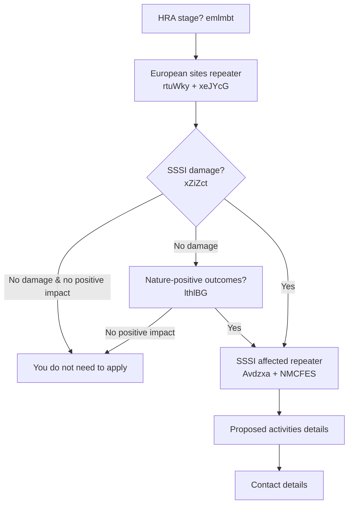
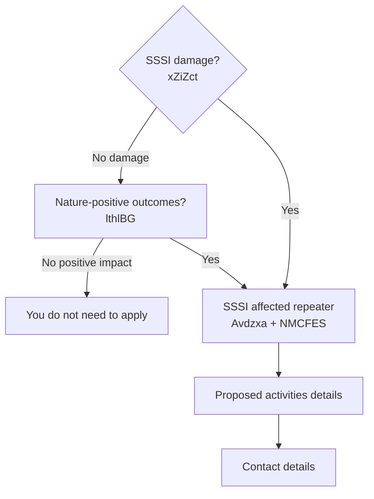
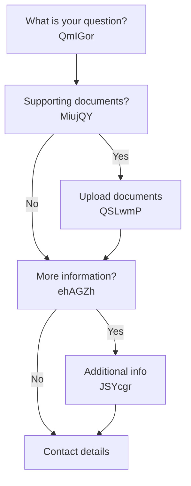
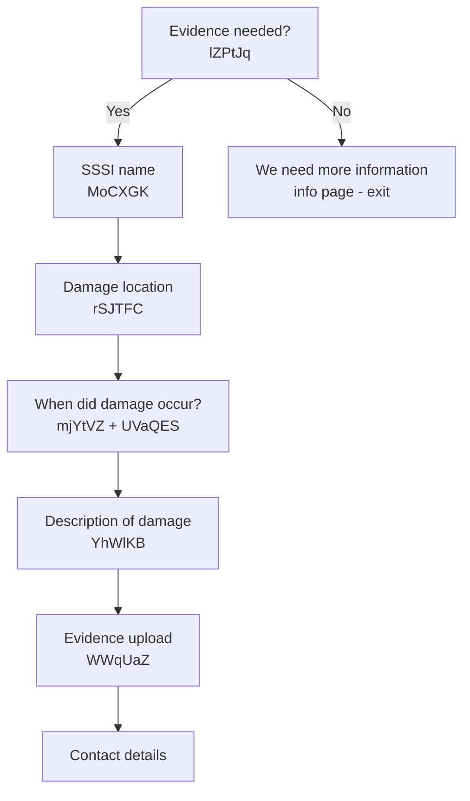
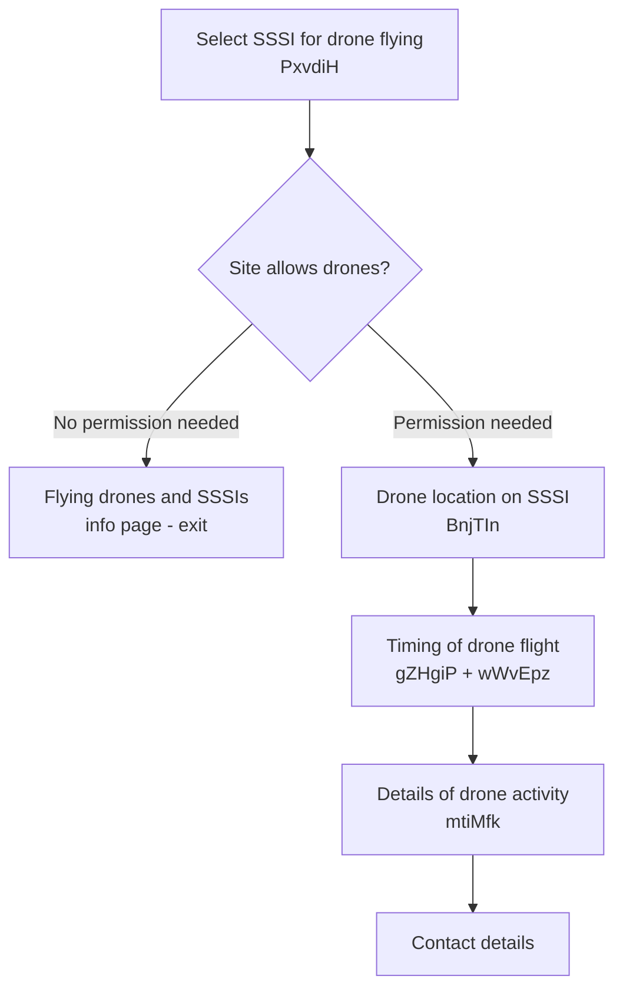
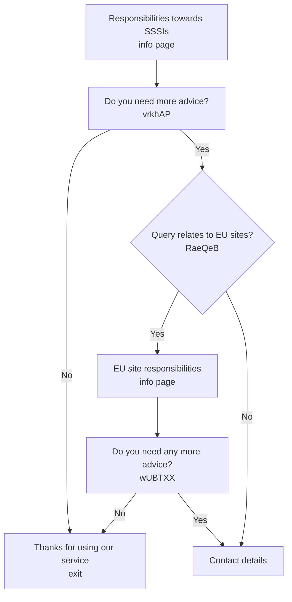

# Advice form routes

This document describes the different routes a user can take through the advice form, organised by the major branching points.

## Applicant category (teEzOl)

The first decision point is "Which category best describes who is making this application?" which determines the user's identity path.

| Category                 | Value               | Next step                                                                                    |
| ------------------------ | ------------------- | -------------------------------------------------------------------------------------------- |
| Consultant               | `Consultant`        | [Who are you working on behalf of?](#working-on-behalf-of-pbmxnm)                            |
| Government Agency        | `Government Agency` | [Which government agency?](#government-agency-path)                                          |
| Harbour authority        | `Harbour authority` | [Which public body?](#public-body-path)                                                      |
| Landowner                | `Landowner`         | [Topic selection](#topic-selection-xzeslq) or [Advice type (S28G)](#advice-type-s28g-yowpaj) |
| Land occupier            | `Land occupier`     | [Topic selection](#topic-selection-xzeslq) or [Advice type (S28G)](#advice-type-s28g-yowpaj) |
| Member of public         | `Member of public`  | [Topic selection](#topic-selection-xzeslq)                                                   |
| Other                    | `Other`             | [Who are you working on behalf of?](#working-on-behalf-of-pbmxnm)                            |
| Local Planning Authority | `Regional body`     | [Which local authority?](#local-authority-path)                                              |
| Utility provider         | `Utility provider`  | [Which public body?](#public-body-path)                                                      |

## Working on behalf of (PBmxNM)

Shown only when category is **Consultant** or **Other**. The user selects who they represent, which then determines the same sub-paths as if the user were that category directly.

| Working on behalf of        | Value                         | Next step                                           |
| --------------------------- | ----------------------------- | --------------------------------------------------- |
| Government agency           | `Government agency`           | [Which government agency?](#government-agency-path) |
| Local Planning Authority    | `Local Planning Authority`    | [Which local authority?](#local-authority-path)     |
| Public body or organisation | `Public body or organisation` | [Which public body?](#public-body-path)             |
| Landowner                   | `Landowner`                   | [Advice type (S28G)](#advice-type-s28g-yowpaj)      |
| Land occupier               | `Land occupier`               | [Advice type (S28G)](#advice-type-s28g-yowpaj)      |
| None of the above           | `None of the above`           | [Advice type (S28G)](#advice-type-s28g-yowpaj)      |

## Government agency path

### Which government agency? (PvUZyQ)

| Agency                  | Next step                                                                                                    |
| ----------------------- | ------------------------------------------------------------------------------------------------------------ |
| Forestry Commission     | [What type of advice? (FC path)](#advice-type-fc-nvrbcy)                                                     |
| Environment Agency      | [Advice type (S28G)](#advice-type-s28g-yowpaj)                                                               |
| Other government agency | [Tell us which agency (hOsLRu)](#other-agency-free-text) then [Advice type (S28G)](#advice-type-s28g-yowpaj) |

### Other agency free text

Page: `/tell-us-which-government-agency-you-work-for` (field: hOsLRu). Free text input, then proceeds to [Advice type (S28G)](#advice-type-s28g-yowpaj).

## Local authority path

Page: `/which-local-authority-do-you-work-for` (field: YouDQP). Autocomplete from 327 local authorities, then proceeds to [Advice type (S28G)](#advice-type-s28g-yowpaj).

## Public body path

### Which public body? (HiTHQX)

Autocomplete from 157 public bodies. If "Other" is selected, the user is taken to `/which-public-body-are-you-representing` (field: OYxtmu) for free text input. Then proceeds to [Advice type (S28G)](#advice-type-s28g-yowpaj).

---

## Advice type: Forestry Commission path (NVRbCy)

Only shown when the government agency is **Forestry Commission**. Page: `/what-type-of-advice-are-you-requesting`

| Advice type      | Value              | Next step                                  |
| ---------------- | ------------------ | ------------------------------------------ |
| HRA advice       | `HRA advice`       | [HRA path](#hra-path)                      |
| S28I SSSI advice | `S28I SSSI advice` | [S28I SSSI path](#s28i-sssi-path)          |
| Something else   | `Something else`   | [Topic selection](#topic-selection-xzeslq) |

### Operations associated with woodland management (S28I only)

When S28I is selected on the FC path, the user sees `/operations-associated-with-woodland-management` with a YesNo field (tCRMKI) asking if operations are associated with woodland management. If **Yes**, they are asked to upload supplementary notice of operations documents (VCkumf).

## Advice type: S28G path (YOwPAJ)

Shown for S28G bodies (LPA, public body, EA, other gov agency, or consultants/others working on their behalf). Page: `/tell-us-which-type-of-advice-you-are-requesting`

| Advice type      | Value                   | Next step                                  |
| ---------------- | ----------------------- | ------------------------------------------ |
| HRA advice       | `Standalone HRA advice` | [HRA path](#hra-path)                      |
| S28i SSSI advice | `S28i SSSI advice`      | [S28I SSSI path](#s28i-sssi-path)          |
| Something else   | `Something else`        | [Topic selection](#topic-selection-xzeslq) |

## Topic selection (xzEslQ)

Shown for non-statutory users (Member of public, Landowner, Land occupier, etc.) or when "Something else" is selected on FC/S28G paths. Page: `/which-topic-fits-the-nature-of-your-question-the-best`

| Topic                                         | Sub-path                                          |
| --------------------------------------------- | ------------------------------------------------- |
| Pre-consent advice (SSSI landowner)           | [General question path](#general-question-path)   |
| Pre-assent advice (public body)               | [Pre-assent advice path](#pre-assent-advice-path) |
| Report potentially damaging activity          | [Damage reporting path](#damage-reporting-path)   |
| Submit/request surveys or SSSI condition info | [General question path](#general-question-path)   |
| Question about NNRs                           | [General question path](#general-question-path)   |
| Designating a Local Nature Reserve (LNR)      | Info page (designating LNRs), then exit           |
| Flying drones on/near a protected site        | [Drone flying path](#drone-flying-path)           |
| Designating or de-designating SSSIs           | Info page (designating SSSIs), then exit          |
| Sale of SSSI land                             | [General question path](#general-question-path)   |
| Something else                                | [General question path](#general-question-path)   |

---

## Major form paths

### HRA path

1. **HRA stage** (emlmbt): "Advice on screening stage" or "Statutory advice on an Appropriate Assessment"
2. **European sites** (repeater TJuSNf): Site name (rtuWky) from 419 Ramsar sites + coordinates (xeJYcG)
3. **Preventing damage to SSSIs** (xZiZct): Yes/No - "Could this plan or project damage or destroy a SSSI?"
4. **Nature-positive outcomes** (lthlBG): Yes/No - shown when S28I advice path with no SSSI damage
5. If SSSI damage or positive impact: **SSSI affected** repeater (Avdzxa + NMCFES)
6. **Proposed activities** (dates, text description or document upload, or both)
7. Contact details and summary

### S28I SSSI path

1. **Preventing damage to SSSIs** (xZiZct)
2. **Nature-positive outcomes** (lthlBG): Only shown on SSSI advice path when no damage
3. **SSSI affected** (repeater): SSSI name (Avdzxa) + coordinates (NMCFES)
4. **Dates** (S28G bodies only, not FC/EA): Proposed activity start (uhRYmA) and end (FlERHC) dates
5. **Proposed activities**: Text (nJVeix) and/or document upload (mSdBUD), depending on PkpWyY selection
6. Contact details and summary

### General question path

Applies to topics: Pre-consent advice, surveys/condition info, NNRs, sale of SSSI land, something else.

### Damage reporting path

### Drone flying path

Only available when category is **Member of public** AND topic is **Flying drones**. If user is an S28G body, they see the info page and cannot proceed to the drone application.

### Pre-assent advice path

---

## Contact details (all paths)

All paths that reach submission end with the same contact pages:

1. `/what-is-your-full-name` (hUpejP)
2. `/what-is-your-contact-number` (wtXodG)
3. `/what-is-your-email-address` (YOPYRe)
4. `/summary` - review and submit

## Exit points (no submission)

Some paths do not result in a submission to CWT:

- **LNR designation** topic: Redirected to external LNR guidance
- **SSSI designation** topic: Redirected to external SSSI guidance
- **No evidence for damage report**: Told to contact NE directly
- **No SSSI damage AND no positive impact**: Told advice is not needed
- **Drone flying not permitted on site**: Info page only
- **Pre-assent advice sufficient**: Thanks page, no further action
