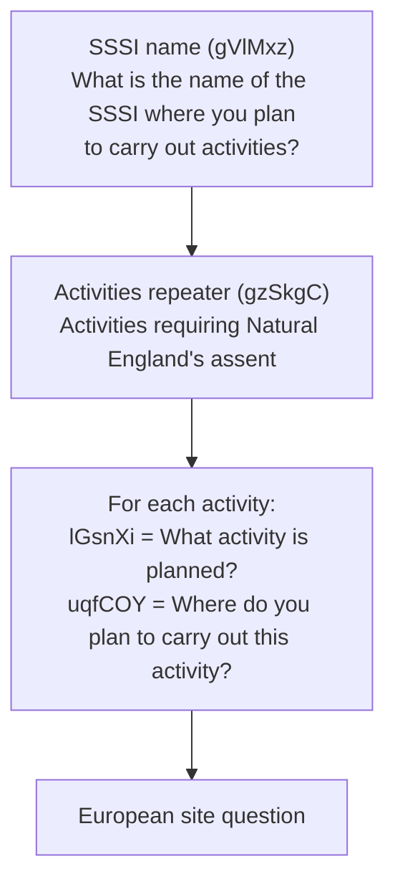
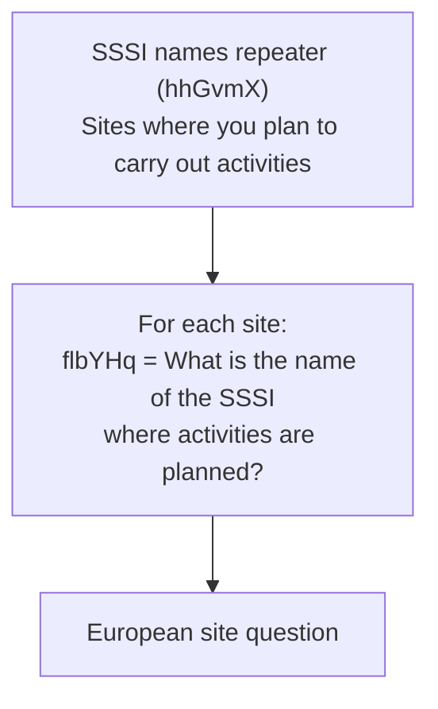
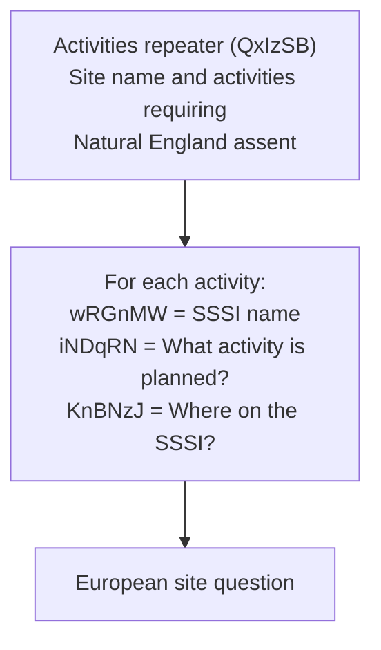

# Assent form routes

This document describes the different routes a user can take through the assent form, organised by the major branching points.

## Customer type (KTObNK)

The first decision point is "What type of customer are you?" which determines the user's identity path.

| Customer type                                      | Value                                                | Next step                                                                 |
| -------------------------------------------------- | ---------------------------------------------------- | ------------------------------------------------------------------------- |
| A public body                                      | `A public body`                                      | [Which category describes the public body?](#public-body-category-vuHwan) |
| An organisation working on behalf of a public body | `An organisation working on behalf of a public body` | [Organisation name](#organisation-name-uedunl)                            |

## Organisation name (ueDuNl)

Shown when customer type is **An organisation working on behalf of a public body**. Question: "What is the name of your organisation?"

Autocomplete from a list of organisations. If "Other" is selected, the user is taken to a free text field (Xszriq - "Other organisation name"). Then proceeds to [Public body category](#public-body-category-vuHwan).

## Public body category (vUHwan)

Shown on **all paths** (no condition). Page question: "Which category best describes the public body you're representing?"

| Category                 | Value                      | Next step                                                          |
| ------------------------ | -------------------------- | ------------------------------------------------------------------ |
| Government agency        | `Government agency`        | [Public body selection](#public-body-selection-cfpoin)             |
| Harbour authority        | `Harbour authority`        | [Public body selection](#public-body-selection-cfpoin)             |
| Landowner                | `Landowner`                | [Public body selection](#public-body-selection-cfpoin)             |
| Land occupier            | `Land occupier`            | [Public body selection](#public-body-selection-cfpoin)             |
| Local planning authority | `Local planning authority` | [Local authority selection](#local-authority-selection-xazlxh)     |
| Utility provider         | `Utility Provider`         | [Public body selection](#public-body-selection-cfpoin)             |
| Other                    | `Other`                    | [Other public body free text](#other-public-body-free-text-fylhmn) |

## Local authority selection (XAZlxH)

Question: "Which local authority are you representing?" Autocomplete from local authorities. Then proceeds to [Land management scheme](#land-management-scheme-rtreXu).

## Public body selection (cfPoiN)

Question: "Which public body are you representing?" Autocomplete from public bodies. If "Other" is selected, user proceeds to [Other public body free text](#other-public-body-free-text-fylhmn). Otherwise proceeds to [Land management scheme](#land-management-scheme-rtreXu).

## Other public body free text (FyLHmN)

Question: "Which public body are you representing?" Free text input. Then proceeds to [Land management scheme](#land-management-scheme-rtreXu).

---

## Land management scheme (rTreXu)

Question: "What land management scheme does this notice relate to?"

| Scheme                   | Value                                                           | Next step                                                  |
| ------------------------ | --------------------------------------------------------------- | ---------------------------------------------------------- |
| CSHT agreement           | `A Countryside Stewardship Higher Tier (CSHT) agreement`        | [CS agreement reference](#cs-agreement-reference-wzjdqg)   |
| CSMT agreement extension | `A Countryside Stewardship Mid Tier (CSMT) agreement extension` | [CS agreement reference](#cs-agreement-reference-wzjdqg)   |
| CS Capital Grants        | `A Countryside Stewardship Capital Grants agreement`            | [CS agreement reference](#cs-agreement-reference-wzjdqg)   |
| HLS agreement            | `A Higher Level Stewardship (HLS) agreement`                    | [HLS agreement reference](#hls-agreement-reference-ofiizi) |
| SFI agreement            | `A Sustainable Farming Incentive (SFI) agreement`               | [SFI agreement reference](#sfi-agreement-reference-nivako) |
| MTA                      | `A Minor and Temporary Adjustments (MTA)`                       | [SSSI selection](#sssi-selection)                          |
| Other schemes            | `Other schemes`                                                 | [SSSI selection](#sssi-selection)                          |

### CS agreement reference (WZJDQG)

Question: "What's your Countryside Stewardship Scheme agreement reference number?" Free text. Then proceeds to [SSSI selection](#sssi-selection).

### HLS agreement reference (OFiizI)

Question: "What is your Higher Level Stewardship (HLS) agreement reference number?" Free text. Then proceeds to [SSSI selection](#sssi-selection).

### SFI agreement reference (niVAkO)

Question: "What's your Sustainable Farming Incentive (SFI) agreement number?" Free text. Then proceeds to [SSSI selection](#sssi-selection).

---

## SSSI selection

### Single or multiple SSSIs (ASataH)

Question: "Are you planning to carry out activities on more than one SSSI?"

| Answer       | Next step                                 |
| ------------ | ----------------------------------------- |
| No / not set | [Single SSSI path](#single-sssi-path)     |
| Yes          | [Multiple SSSI path](#multiple-sssi-path) |

### Single SSSI path

1. **SSSI name** (gVlMxz): "What is the name of the SSSI where you plan to carry out activities?" - autocomplete
2. **Activities repeater** (gzSkgC): "Activities requiring Natural England's assent"
   - lGsnXi: "What activity is planned to be carried out?"
   - uqfCOY: "Where do you plan to carry out this activity?" (easting/northing coordinates)
3. Proceeds to [European site question](#european-site-question-xydydud)

### Multiple SSSI path

Two sub-paths depending on whether it is a scheme-based submission or an ORNEC-based submission:

#### Scheme path (CS/HLS/MTA)

#### ORNEC path

---

## European site question (XydYUD)

Question: "Could the planned activities affect a European site?"

| Answer | Next step                                                |
| ------ | -------------------------------------------------------- |
| Yes    | [European site repeater](#european-site-repeater-aqywxd) |
| No     | [Contact details](#contact-details)                      |

### European site repeater (aQYWxD)

Repeater: "European site affected"

- IzQfir: "What is the name of the European site?" - autocomplete from European sites list

Then proceeds to [Contact details](#contact-details).

---

## Contact details

All paths that reach submission end with the same contact pages:

1. First name (htlAAq): "What is your first name?"
2. Last name (pPocjH): "What is your last name?"
3. Email address (skdDtj): "What is your email address?"
4. Summary - review and submit
