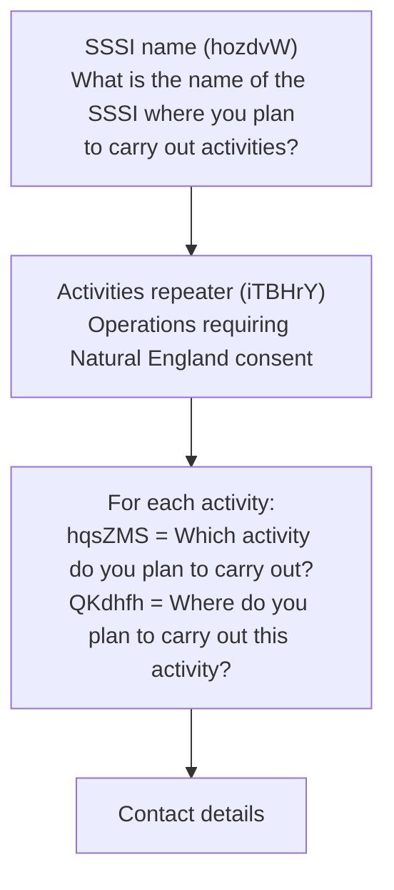
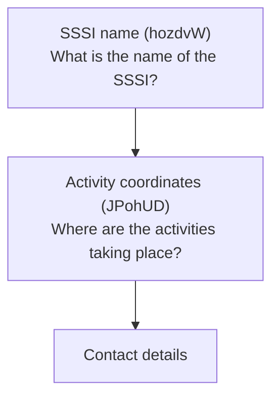
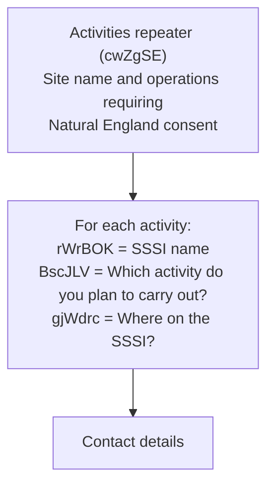
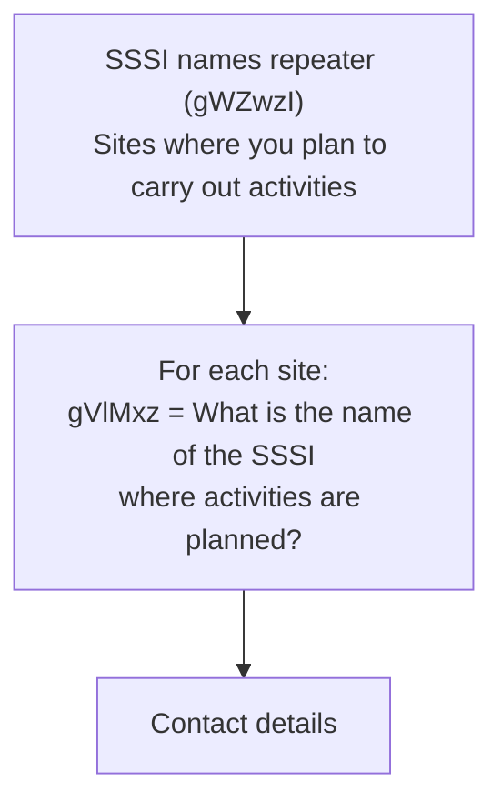

# Consent form routes

This document describes the different routes a user can take through the consent form, organised by the major branching points.

## Customer type (KTObNK)

The first decision point is "What type of customer are you?" which determines the user's identity path.

| Customer type                                                           | Value                                                                                     | Next step                                                |
| ----------------------------------------------------------------------- | ----------------------------------------------------------------------------------------- | -------------------------------------------------------- |
| An owner of land within a SSSI                                          | `An owner of land within a SSSI`                                                          | [Land management scheme](#land-management-scheme-rtreXu) |
| An occupier of land within a SSSI                                       | `An occupier of land within a SSSI`                                                       | [Land management scheme](#land-management-scheme-rtreXu) |
| Someone working on behalf of an owner or occupier of land within a SSSI | `Someone with permission to work on behalf of an owner or occupier of land within a SSSI` | [Land management scheme](#land-management-scheme-rtreXu) |
| Somebody else                                                           | `Somebody else`                                                                           | [Land management scheme](#land-management-scheme-rtreXu) |

**Note:** Unlike the assent form, the consent form does not have a public body category selection or organisation lookup. The customer type maps directly to `consulting_body_type`.

---

## Land management scheme (rTreXu)

Question: "What land management scheme does this notice relate to?"

| Scheme                   | Value                                                           | Next step                                                  |
| ------------------------ | --------------------------------------------------------------- | ---------------------------------------------------------- |
| CSHT agreement           | `A Countryside Stewardship Higher Tier (CSHT) agreement`        | [CS agreement reference](#cs-agreement-reference-wzjdqg)   |
| CSMT agreement extension | `A Countryside Stewardship Mid Tier (CSMT) agreement extension` | [CS agreement reference](#cs-agreement-reference-wzjdqg)   |
| CS Capital Grants        | `A Countryside Stewardship Capital Grants agreement`            | [CS agreement reference](#cs-agreement-reference-wzjdqg)   |
| HLS agreement            | `A Higher Level Stewardship (HLS) agreement`                    | [HLS agreement reference](#hls-agreement-reference-ofiizi) |
| SFI agreement            | `A Sustainable Farming Incentive (SFI) agreement`               | [SFI agreement reference](#sfi-agreement-reference-nivako) |
| MTA                      | `A Minor and Temporary Adjustments (MTA)`                       | [SSSI selection](#sssi-selection)                          |
| Other schemes            | `Other schemes`                                                 | [SSSI selection](#sssi-selection)                          |

When no scheme is selected, the form may also have an "other permission" path where VacBun ("What is the name of the permission?") is collected.

### CS agreement reference (WZJDQG)

Question: "What's your Countryside Stewardship agreement reference number?" Free text. Then proceeds to [SSSI selection](#sssi-selection).

### HLS agreement reference (OFiizI)

Question: "What's your Higher Level Stewardship agreement reference number?" Free text. Then proceeds to [SSSI selection](#sssi-selection).

### SFI agreement reference (niVAkO)

Question: "What's your Sustainable Farming Incentive agreement number?" Free text. Then proceeds to [SSSI selection](#sssi-selection).

---

## SBI (Single Business Identifier)

Two possible SBI fields depending on the path:

- rkIHYS: "What is the Single Business Identifier (SBI) number of where the activities will take place?" - mandatory SBI page shown when a land management scheme is selected (page 15, primary)
- VLUhzR: "Single business identifier (SBI)" - optional SBI field on the landowner/occupier address details page (page 39, fallback)

rkIHYS takes priority; VLUhzR is used if rkIHYS is not present. Converted to a number.

---

## SSSI selection

### Single or multiple SSSIs (lmqMaY)

Question: "Are you planning to carry out activities on more than one SSSI?"

| Answer       | Next step                                 |
| ------------ | ----------------------------------------- |
| No / not set | [Single SSSI path](#single-sssi-path)     |
| Yes          | [Multiple SSSI path](#multiple-sssi-path) |

### Single SSSI path

#### Non-scheme path (ORNEC activities)

1. **SSSI name** (hozdvW): "What is the name of the SSSI where you plan to carry out activities?" - autocomplete
2. **Activities repeater** (iTBHrY): "Operations requiring Natural England consent"
   - hqsZMS: "Which activity do you plan to carry out?"
   - QKdhfh: "Where do you plan to carry out this activity?" (easting/northing coordinates)
3. Proceeds to [Contact details](#contact-details)

#### Scheme path (CS/HLS/MTA)

1. **SSSI name** (hozdvW): same autocomplete
2. **Activity coordinates** (JPohUD): "Where are the activities taking place?" (single easting/northing)
3. Proceeds to [Contact details](#contact-details)

### Multiple SSSI path

Two sub-paths depending on whether it is a scheme-based or ORNEC-based submission:

#### Non-scheme path (ORNEC activities)

#### Scheme path (CS/HLS/MTA)

---

## Contact details

All paths that reach submission end with the same contact pages:

1. First name (htlAAq): "What is your first name?"
2. Last name (pPocjH): "What is your last name?"
3. Email address (skdDtj): "What's your email address?"
4. Summary - review and submit
